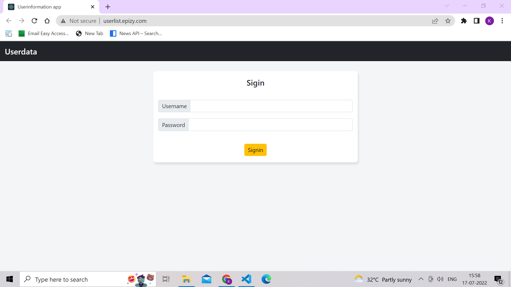
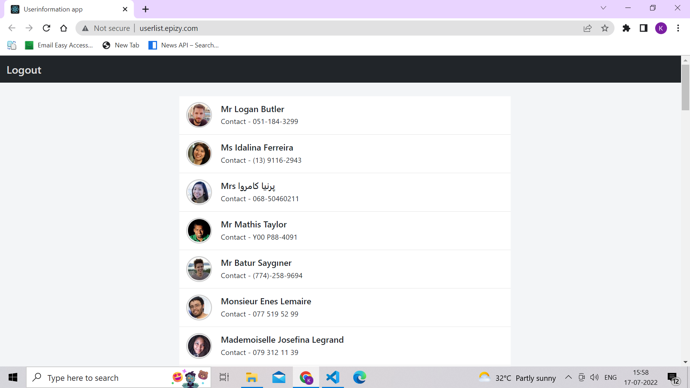

# Userlist

# About Project 

Responsive infinite scrolling list in React for fixed array of items . 

# How to run Project 
command - npm run start   
Also, Availble build of project in build folder   
For, Run project on static server run index.html from Build folder   
For check project live visit below url  
[Live project url](http://userlist.epizy.com)   
   

# Overview of Project

 
 
 
